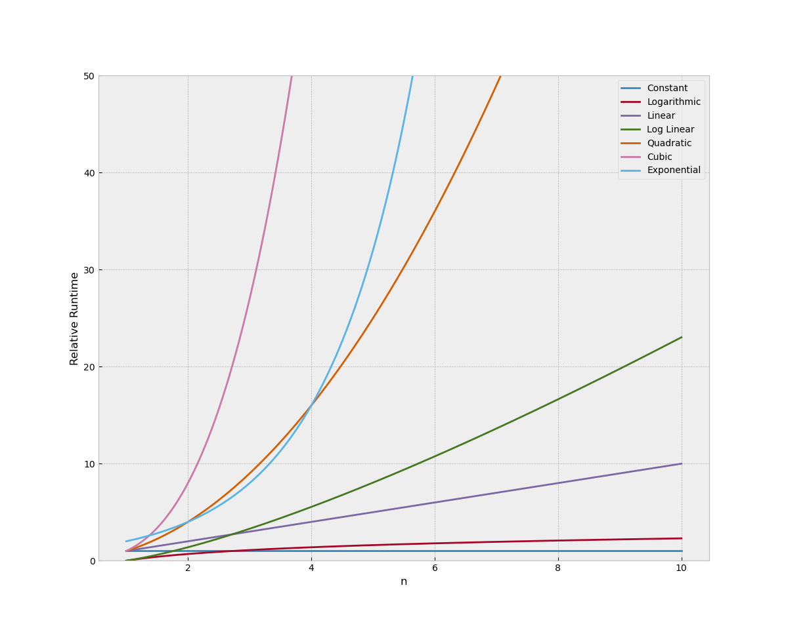

# Basics of Algorithms and Complexity

A comprehensive introduction to algorithms and complexity, complete with coded examples to help you understand the concepts in practice.

---

## What is an Algorithm?

In computer science, an **algorithm** is a well-defined sequence of steps or instructions designed to solve a specific problem or perform a task. Algorithms are the foundation of programming and computational problem-solving.

### Key Properties of an Algorithm:

1. **Input and Output**: An algorithm must have clearly defined inputs and produce a well-defined output.
2. **Definiteness**: Each step in the algorithm must be precise and unambiguous.
3. **Finiteness**: The algorithm must terminate after a finite number of steps.
4. **Effectiveness**: Each step must be basic enough to be carried out, in principle, by a human using pen and paper.
5. **Order**: The steps must be executed in a specific, logical sequence.

### Common Types of Algorithms:

- **Searching Algorithms**:
  - **Binary Search**: Efficiently finds an element in a sorted array by repeatedly dividing the search interval in half.
  - **Linear Search**: Sequentially checks each element in a list until the desired element is found or the list ends.
- **Sorting Algorithms**:
  - Examples include Quick Sort, Merge Sort, and Bubble Sort.
- **Hashing Algorithms**:
  - Converts input data of arbitrary length into a fixed-length output (hash). Hashing is widely used in data retrieval and cryptography.

This repository includes simple Python implementations of these algorithms to help you understand their functionality.

---

## What is Complexity?

The **complexity** of an algorithm refers to the amount of resources it consumes, such as time and space, as a function of the input size. Complexity is a critical factor in evaluating the efficiency and scalability of an algorithm.

### Types of Complexity:

1. **Time Complexity**: Measures the time an algorithm takes to complete as a function of the input size.
2. **Space Complexity**: Measures the amount of memory an algorithm uses during execution.

### Big-O Notation:
Big-O notation is a mathematical representation used to describe the upper bound of an algorithm's growth rate. It provides a way to objectively compare the efficiency of different algorithms, independent of hardware or implementation details.

#### Common Big-O Functions:

- **O(1)**: Constant time – the algorithm's runtime does not depend on the input size.
- **O(log n)**: Logarithmic time – the runtime grows logarithmically with the input size.
- **O(n)**: Linear time – the runtime grows linearly with the input size.
- **O(n log n)**: Log-linear time – common in efficient sorting algorithms like Merge Sort.
- **O(n²)**: Quadratic time – often seen in less efficient algorithms like Bubble Sort.
- **O(2ⁿ)**: Exponential time – runtime doubles with each additional input element, often seen in brute-force algorithms.

Below is a visual representation of these growth rates:

---

## Why Study Algorithms and Complexity?

Understanding algorithms and complexity is essential for:

- Writing efficient and scalable code.
- Solving computational problems effectively.
- Preparing for technical interviews and competitive programming.
- Building a strong foundation in computer science.

---

## Sources and References

- **Python for Data Structures and Algorithms** by Jose Portilla.
- Additional resources:
  - [Introduction to Algorithms](https://mitpress.mit.edu/9780262046305/) by Cormen, Leiserson, Rivest, and Stein.
  - [GeeksforGeeks](https://www.geeksforgeeks.org/) – A comprehensive resource for algorithms and data structures.
  - [Big-O Cheat Sheet](https://www.bigocheatsheet.com/) – A quick reference for algorithm complexities.

---

Feel free to explore the repository and experiment with the provided Python implementations. Contributions and suggestions are welcome!
